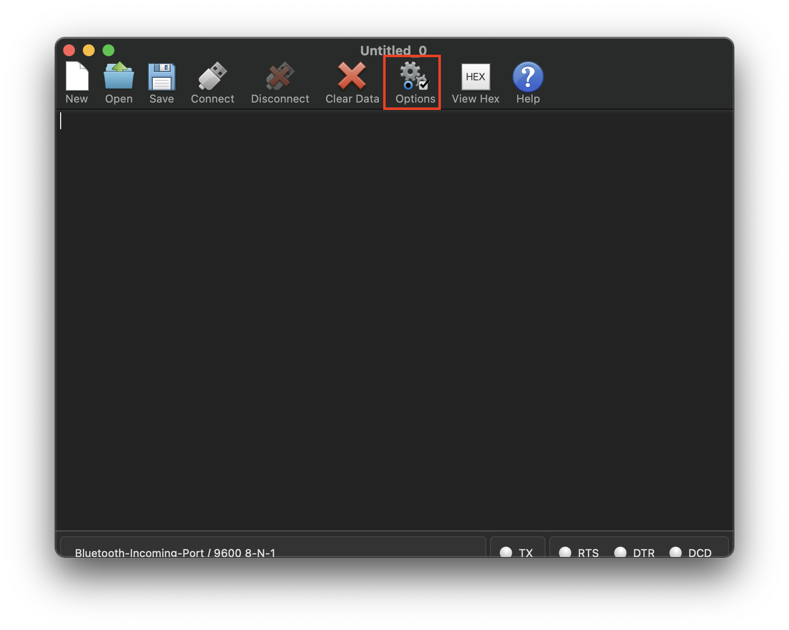

# Kernel Debugging

This section will go a bit deeper into the troubleshooting rabbit hole, specifically focussing on more low level debugging with serial and proper logging.

## Serial Setup

While optional, serial can be super helpful in grabbing all the important info flooding your PC. It's also the only way to properly log super early kernel panics(such as things right after `[EB|#LOG:EXITBS:START]`)

For this setup, you'll need a few things:

* A serial header/port on the test machine
* A serial-to-serial or serial-to-USB cable
* A second machine to receive the serial logging(with either Serial or USB)
* Software to monitor the serial output
  * For this guide, we'll use [CoolTerm](https://freeware.the-meiers.org) as it supports macOS, Linux, Windows and even Raspberry Pi's

For this example, we'll be using an Asus X299-E Strix board which does have a serial header. To verify whether your board comes with one, check the owners or service manual and search for the serial/COM port:


As you can see, we have a COM port on the bottom of our motherboard and even provides us with a diagram for manually hooking up our serial pins if you're not using a 9/10 Pin Serial Header to DB9 adapter. 

For me, I'm using a simple [Serial header to DB9](https://www.amazon.ca/gp/product/B001Y1F0HW/ref=ppx_yo_dt_b_asin_title_o00_s00?ie=UTF8&psc=1), then a [DB9 to USB  RS 232 adapter](https://www.amazon.ca/gp/product/B075YGKFC1/ref=ppx_yo_dt_b_asin_title_o00_s01?ie=UTF8&psc=1) which finally terminates at my laptop.

The OpenCore manual generally recommends CP21202-based UART devices:

```
To obtain the log during boot you can make the use of serial port debugging. Serial port debugging is enabled in Target, e.g. 0xB for onscreen with serial. OpenCore uses 115200 baud rate, 8 data bits, no parity, and 1 stop bit. For macOS your best choice are CP2102-based UART devices. Connect motherboard TX to USB UART RX, and motherboard GND to USB UART GND. Use screen utility to get the output, or download GUI software, such as CoolTerm.
Note: On several motherboards (and possibly USB UART dongles) PIN naming may be incorrect. It is very common to have GND swapped with RX, thus you have to connect motherboard “TX” to USB UART GND, and motherboard “GND” to USB UART RX.
```


### Config.plist settings

For serial setup, OpenCore actually makes this quite straight forward. 

#### Misc

* **SerialInt**: YES
  * Allows for serial output
* **Target**: `75`
  * This is simply combo 67 with the additional serial output flag(0x08)
  * You can calculate your own vale here: OpenCore debugging](../debug.md)
  

#### NVRAM

##### boot-args

Here we get to set some variables that will help us with serial output, for us we'll be using the following boot-args:

```
-v keepsyms=1 debug=0x8 serial=5 msgbuf=1048576
```

Now lets go over what each arg does:

* **-v**
  * Enables verbose output
* **keepsyms=1**
  * Ensures symbols are kept during kernel panics, which are greatly helpful for troubleshooting
* **debug=0x8**
  * Enables serial debugging with the kernel
  * For a full list of values: [debug.h](https://github.com/apple/darwin-xnu/blob/master/osfmk/kern/debug.h#L419L447)

| Value | Comment |
| :--- | :--- |


### CoolTerm settings

Now lets fire up [CoolTerm](https://freeware.the-meiers.org) and set a few options. When you open CoolTermn, you'll likely be greeted with a simple window. here select the Options entry:




Here we're given quite a few options, but the mains ones we care about are:


* Port: Ensure this 
* Baudrate = 115200
* Data Bits = 8
* Parity = none
* Stop Bit = 1
