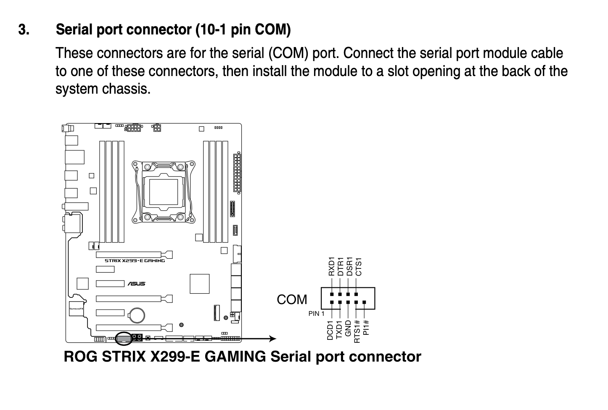

# Kernel Debugging

This section will go a bit deeper into the troubleshooting hole, specifically focussing on more low level debugging with serial and proper logging

## Serial Setup

While optional, serial can be super helpful in grabbing all the important info flooding your PC. It's also the only way to properly log super early kernel panics(such as `[EB|#LOG:EXITBS:START]`)

For this setup, you'll need a few things:

* A serial header/port on the test machine
* A serial-to-serial or serial-to-USB cable
* A second machine to receive the serial logging(with either Serial or USB)
* Software to monitor the serial output
  * For this guide, we'll use [CoolTerm](https://freeware.the-meiers.org) as it supports macOS, Linux, Windows and even Raspberry Pi's

For this example, we'll be using an Asus X299-E Strix board which does have a serial header. To verify whether your board comes with one, check the owners or service manual and search for the serial/COM port:

As you can see, we have a COM port on the bottom of our motherboard and even provides us with a diagram for manually hooking up our serial pins if not using a [9/10 Pin Serial Header to DB9 adapter](https://www.startech.com/ca/Cables/Serial-Parallel-PS-2/DB9-DB25/1-Port-16in-DB9-Serial-Port-Bracket-to-10-Pin-Header-Low-Profile~PLATE9M16LP)
